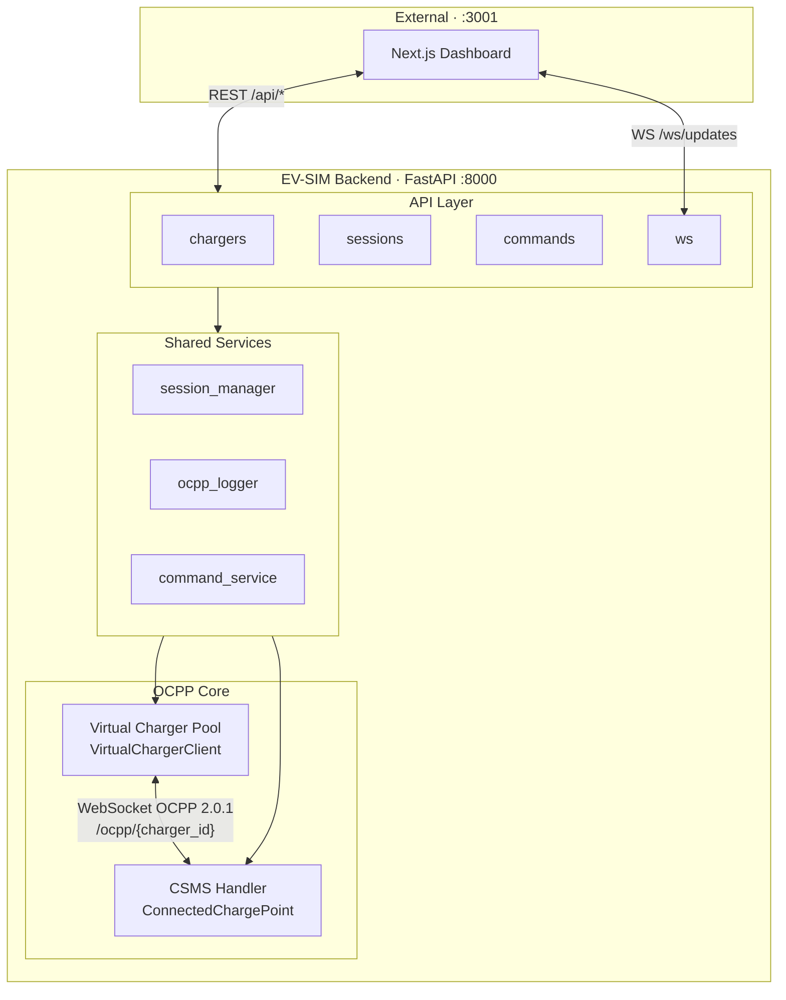
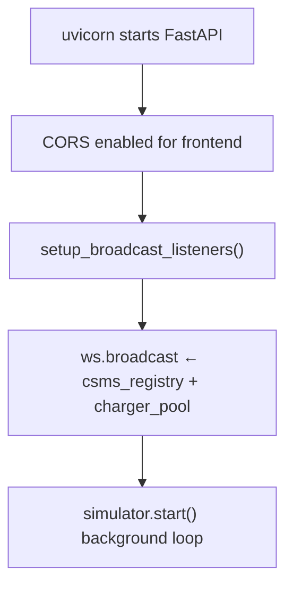
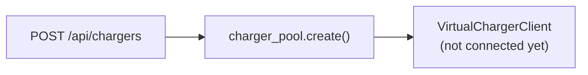
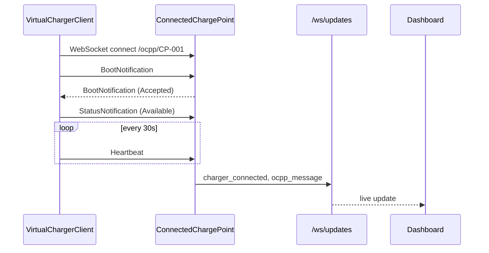
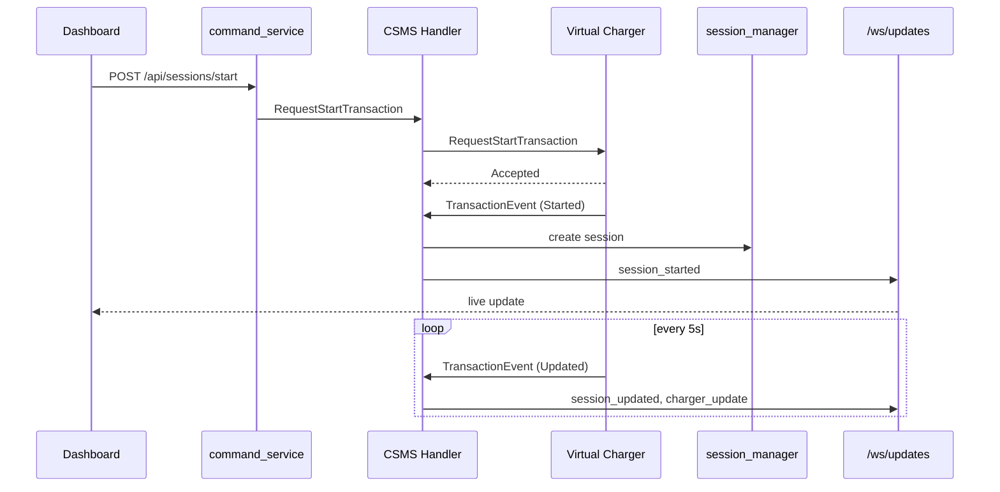
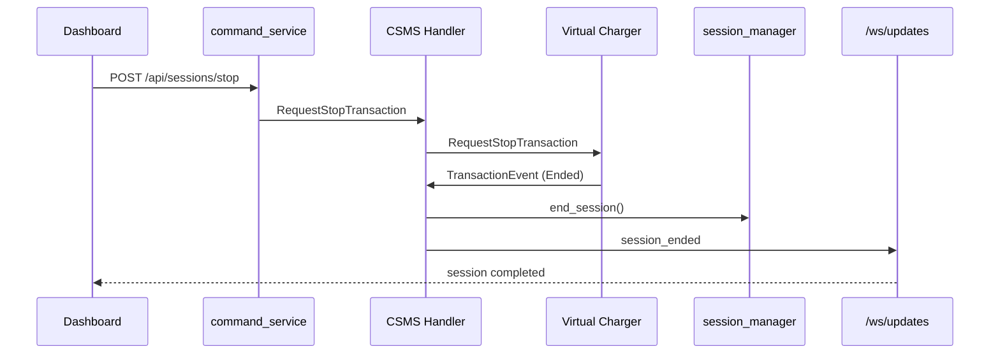
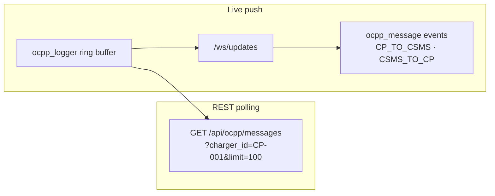
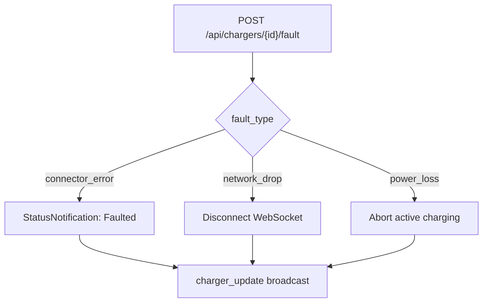

# EV-SIM Backend

Python backend for **EV-SIM** — an interactive platform that simulates virtual EV charge points (CP) connected to a CitrineOS-inspired Charging Station Management System (CSMS) over **OCPP 2.0.1**. The backend exposes REST APIs and WebSockets for a Next.js dashboard and runs both the CSMS handler and virtual charger clients in a single process.

---

## Table of Contents

- [Tech Stack & Versions](#tech-stack--versions)
- [Folder Structure](#folder-structure)
- [Module Reference](#module-reference)
- [Architecture Overview](#architecture-overview) — system diagram with layer breakdown
- [Full Workflow](#full-workflow) — step-by-step flows (use navigation buttons to move between steps)
- [API Reference](#api-reference)
- [WebSocket Events](#websocket-events)
- [OCPP Message Flow](#ocpp-message-flow)
- [Getting Started](#getting-started)
- [Frontend Integration](#frontend-integration)

---

## Tech Stack & Versions

| Technology | Version | Role |
|------------|---------|------|
| **Python** | 3.14+ (tested) | Runtime |
| **FastAPI** | 0.137.1 | HTTP API framework, WebSocket server |
| **Uvicorn** | 0.49.0 | ASGI server |
| **Starlette** | 1.3.1 | ASGI toolkit (FastAPI dependency) |
| **mobilityhouse/ocpp** | 2.1.0 | OCPP 2.0.1 protocol library |
| **Pydantic** | 2.13.4 | Request/response validation & schemas |
| **websockets** | 16.0 | Virtual charger OCPP client connections |
| **aiosqlite** | 0.22.0 | Async SQLite (reserved for future persistence) |
| **python-multipart** | 0.0.32 | Form data parsing |

Minimum versions are declared in `requirements.txt`:

```
fastapi>=0.115.0
uvicorn[standard]>=0.32.0
ocpp>=2.0.0
websockets>=13.0
pydantic>=2.0.0
python-multipart>=0.0.12
aiosqlite>=0.20.0
```

---

## Folder Structure

```
backend/
├── README.md                 # This file
├── requirements.txt          # Python dependencies
├── .gitignore
│
└── app/
    ├── main.py               # FastAPI app entry point, OCPP WebSocket endpoint
    │
    ├── api/                  # REST & dashboard WebSocket routes
    │   ├── chargers.py       # Charger CRUD, connect/disconnect, fault injection
    │   ├── sessions.py       # Remote start/stop charging sessions
    │   ├── commands.py       # Reset, availability, unlock connector
    │   └── ws.py             # Real-time broadcast to frontend clients
    │
    ├── csms/                 # CSMS (server-side OCPP handler)
    │   ├── csms_handler.py   # OCPP 2.0.1 message handlers & registry
    │   ├── command_service.py# Sends CSMS→CP commands (remote start/stop, etc.)
    │   ├── session_manager.py# In-memory charging session tracking
    │   └── ws_adapter.py     # Adapts FastAPI WebSocket to ocpp library
    │
    ├── virtual_charger/      # Simulated charge point clients
    │   ├── charger.py        # OCPP CP client: boot, heartbeat, transactions
    │   ├── charger_pool.py   # Pool of virtual chargers, connect to CSMS
    │   └── simulator.py      # Background simulation loop (lifecycle hook)
    │
    ├── models/
    │   └── schemas.py        # Pydantic models: Charger, Session, OcppMessage, etc.
    │
    └── ocpp_log/
        └── logger.py         # Ring buffer of OCPP messages for the explorer UI
```

---

## Module Reference

### `app/main.py`

Application entry point. Creates the FastAPI app with CORS, registers API routers, and defines:

- **`/ocpp/{charger_id}`** — OCPP 2.0.1 WebSocket endpoint (subprotocol `ocpp2.0.1`) where virtual chargers connect as clients and the CSMS acts as server.
- **`/api/ocpp/messages`** — Returns the OCPP message log (optionally filtered by `charger_id`).
- **`/api/health`** — Health check with charger and connection counts.

On startup (`lifespan`): wires broadcast listeners and starts the simulator. On shutdown: stops the simulator.

### `app/api/chargers.py`

| Endpoint | Description |
|----------|-------------|
| `GET /api/chargers` | List all virtual chargers |
| `POST /api/chargers` | Create a new virtual charger |
| `GET /api/chargers/{id}` | Get charger details |
| `DELETE /api/chargers/{id}` | Remove a charger |
| `POST /api/chargers/{id}/connect` | Connect charger to CSMS (runs BootNotification) |
| `POST /api/chargers/{id}/disconnect` | Disconnect from CSMS |
| `POST /api/chargers/{id}/fault` | Inject fault (`connector_error`, `network_drop`, `power_loss`) |

### `app/api/sessions.py`

| Endpoint | Description |
|----------|-------------|
| `GET /api/sessions` | List all sessions |
| `GET /api/sessions/{id}` | Get session by ID |
| `POST /api/sessions/start` | Remote start via `RequestStartTransaction` |
| `POST /api/sessions/stop` | Remote stop via `RequestStopTransaction` |

### `app/api/commands.py`

| Endpoint | Description |
|----------|-------------|
| `POST /api/commands/reset` | Send `Reset` (Immediate / OnIdle) |
| `POST /api/commands/availability` | Send `ChangeAvailability` |
| `POST /api/commands/unlock` | Send `UnlockConnector` |

### `app/api/ws.py`

- **`/ws/updates`** — WebSocket for the frontend. Subscribes to events from `csms_registry` and `charger_pool` and broadcasts JSON `{ type, data }` to all connected dashboard clients.

### `app/csms/csms_handler.py`

Core CSMS logic built on `ocpp.v201.ChargePoint`. The `ConnectedChargePoint` class handles incoming OCPP messages from charge points:

- **BootNotification** — Accepts registration, sets heartbeat interval
- **Heartbeat** — Responds with current time
- **StatusNotification** — Maps connector status to charger state
- **Authorize** — Always accepts demo tokens
- **TransactionEvent** — Creates/updates/ends sessions in `session_manager`
- **MeterValues** — Updates session meter data

Also sends outbound commands: `RequestStartTransaction`, `RequestStopTransaction`, `Reset`, `ChangeAvailability`, `UnlockConnector`.

`CsmsRegistry` manages one `ConnectedChargePoint` per connected charger ID.

### `app/csms/ws_adapter.py`

Bridges FastAPI's `WebSocket` API (`receive`/`send_text`) to the interface expected by the `ocpp` library (`recv`/`send`).

### `app/csms/command_service.py`

Thin service layer that looks up the connected charge point in `csms_registry` and delegates to `ConnectedChargePoint` send methods. Used by REST session and command endpoints.

### `app/csms/session_manager.py`

In-memory store for charging sessions. Tracks start/end times, energy, power, SoC, and meter value history.

### `app/virtual_charger/charger.py`

`VirtualChargerClient` extends `ocpp.v201.ChargePoint` and acts as a simulated charge point:

- Connects to `ws://localhost:8000/ocpp/{charger_id}`
- Runs **BootNotification** → **Heartbeat** loop
- Handles **RequestStartTransaction** / **RequestStopTransaction** from CSMS
- Simulates charging with periodic **TransactionEvent** (Updated) including power, energy, SoC, voltage, current
- Supports fault injection (network drop, connector fault, power loss)

### `app/virtual_charger/charger_pool.py`

Singleton `charger_pool` that creates, lists, connects, disconnects, and removes virtual chargers. Default CSMS URL: `ws://localhost:8000/ocpp`.

### `app/virtual_charger/simulator.py`

Background asyncio loop started at app lifespan. Reserved for future periodic simulation tasks.

### `app/models/schemas.py`

Pydantic models shared across the app:

- **ChargerStatus**, **SessionStatus**, **MessageDirection**, **MessageType** — Enums
- **ChargerConfig**, **VirtualCharger**, **Session**, **MeterValue** — Domain models
- **OcppMessage** — Log entry for the OCPP explorer
- **CreateChargerRequest**, **StartSessionRequest**, **StopSessionRequest**, etc. — API request bodies

### `app/ocpp_log/logger.py`

Ring buffer (max 500 messages) of `OcppMessage` records. Both CP and CSMS sides log through this for the `/api/ocpp/messages` endpoint and live UI updates.

---

## Architecture Overview

<p align="center">
  <a href="#full-workflow"></a>
  <a href="#ocpp-message-flow"></a>
</p>



| Layer | Components | Responsibility |
|-------|------------|----------------|
| API | `chargers` · `sessions` · `commands` · `ws` | REST endpoints and dashboard WebSocket broadcast |
| Shared Services | `session_manager` · `ocpp_logger` · `command_service` | Sessions, message log, outbound OCPP commands |
| OCPP Core | Virtual Charger Pool · CSMS Handler | Simulated CP clients and server-side OCPP 2.0.1 handling |

The backend is **monolithic but dual-role**: the same process hosts the CSMS WebSocket server and spawns virtual charger clients that connect back to it. This makes local development and demos simple without external infrastructure.

---

## Full Workflow

Use the buttons below to jump between workflow steps.

<p align="center">
  <a href="#wf-1"></a>
  <a href="#wf-2"></a>
  <a href="#wf-3"></a>
  <a href="#wf-4"></a>
  <a href="#wf-5"></a>
  <a href="#wf-6"></a>
  <a href="#wf-7"></a>
</p>

---

<h3 id="wf-1">1. Startup</h3>

```bash
uvicorn app.main:app --reload --host 0.0.0.0 --port 8000
```



<p align="center">
  <a href="#wf-2"></a>
</p>

---

<h3 id="wf-2">2. Create a Virtual Charger</h3>

```http
POST /api/chargers
{ "id": "CP-001", "max_power_kw": 22, "connector_count": 1 }
```



<p align="center">
  <a href="#wf-1"></a>
  <a href="#wf-3"></a>
</p>

---

<h3 id="wf-3">3. Connect to CSMS</h3>

```http
POST /api/chargers/CP-001/connect
```



<p align="center">
  <a href="#wf-2"></a>
  <a href="#wf-4"></a>
</p>

---

<h3 id="wf-4">4. Remote Start Session</h3>

```http
POST /api/sessions/start
{ "charger_id": "CP-001", "connector_id": 1 }
```



`session_manager` creates a session; meter values update energy, power, and SoC.

<p align="center">
  <a href="#wf-3"></a>
  <a href="#wf-5"></a>
</p>

---

<h3 id="wf-5">5. Remote Stop Session</h3>

```http
POST /api/sessions/stop
{ "charger_id": "CP-001" }
```



<p align="center">
  <a href="#wf-4"></a>
  <a href="#wf-6"></a>
</p>

---

<h3 id="wf-6">6. OCPP Explorer</h3>



- **REST:** `GET /api/ocpp/messages?charger_id=CP-001&limit=100`
- **Live:** `ocpp_message` events on `/ws/updates` with direction `CP_TO_CSMS` or `CSMS_TO_CP`

<p align="center">
  <a href="#wf-5"></a>
  <a href="#wf-7"></a>
</p>

---

<h3 id="wf-7">7. Fault Injection</h3>

```http
POST /api/chargers/CP-001/fault?fault_type=connector_error
```



<p align="center">
  <a href="#wf-6"></a>
  <a href="#wf-1"></a>
</p>

---

## API Reference

### Chargers

| Method | Path | Body / Params | Response |
|--------|------|---------------|----------|
| GET | `/api/chargers` | — | `VirtualCharger[]` |
| POST | `/api/chargers` | `CreateChargerRequest` | `VirtualCharger` (201) |
| GET | `/api/chargers/{id}` | — | `VirtualCharger` |
| DELETE | `/api/chargers/{id}` | — | 204 |
| POST | `/api/chargers/{id}/connect` | — | `VirtualCharger` |
| POST | `/api/chargers/{id}/disconnect` | — | `VirtualCharger` |
| POST | `/api/chargers/{id}/fault` | `?fault_type=` | `{ success, fault_type }` |

### Sessions

| Method | Path | Body | Response |
|--------|------|------|----------|
| GET | `/api/sessions` | — | `Session[]` |
| GET | `/api/sessions/{id}` | — | `Session` |
| POST | `/api/sessions/start` | `StartSessionRequest` | `{ success, status }` |
| POST | `/api/sessions/stop` | `StopSessionRequest` | `{ success, status }` |

### Commands

| Method | Path | Body | Response |
|--------|------|------|----------|
| POST | `/api/commands/reset` | `ResetRequest` | `{ success, status }` |
| POST | `/api/commands/availability` | `AvailabilityRequest` | `{ success, status }` |
| POST | `/api/commands/unlock` | `UnlockRequest` | `{ success, status }` |

### Other

| Method | Path | Description |
|--------|------|-------------|
| GET | `/api/health` | `{ status, chargers, connected }` |
| GET | `/api/ocpp/messages` | OCPP log (`charger_id`, `limit` query params) |
| WS | `/ocpp/{charger_id}` | OCPP 2.0.1 charge point protocol |
| WS | `/ws/updates` | Dashboard real-time events |

Interactive API docs: [http://localhost:8000/docs](http://localhost:8000/docs)

---

## WebSocket Events

Events broadcast on `/ws/updates` as `{ "type": "<event>", "data": { ... } }`:

| Event | When |
|-------|------|
| `ocpp_message` | Any OCPP request/response logged |
| `charger_connected` | BootNotification accepted |
| `charger_disconnected` | Virtual charger disconnected |
| `charger_update` | Status, heartbeat, or meter change |
| `session_started` | TransactionEvent Started |
| `session_updated` | Meter values during charging |
| `session_ended` | TransactionEvent Ended |

---

## OCPP Message Flow

```mermaid
flowchart LR
    subgraph CP["Charge Point → CSMS"]
        direction TB
        A1["BootNotification"]
        A2["Heartbeat"]
        A3["StatusNotification"]
        A4["Authorize"]
        A5["TransactionEvent"]
        A6["MeterValues"]
    end

    subgraph CSMS["CSMS → Charge Point"]
        direction TB
        B1["RequestStartTransaction"]
        B2["RequestStopTransaction"]
        B3["Reset"]
        B4["ChangeAvailability"]
        B5["UnlockConnector"]
    end

    CP <-->|"OCPP-J · WebSocket<br/>subprotocol ocpp2.0.1"| CSMS
```

<p align="center">
  <a href="#architecture-overview"></a>
  <a href="#full-workflow"></a>
</p>



| Direction | Actions |
|-----------|---------|
| CP → CSMS | BootNotification, Heartbeat, StatusNotification, Authorize, TransactionEvent, MeterValues |
| CSMS → CP | RequestStartTransaction, RequestStopTransaction, Reset, ChangeAvailability, UnlockConnector |

Message format follows OCPP-J (JSON over WebSocket) with subprotocol `ocpp2.0.1`.

---

## Getting Started

### Prerequisites

- Python 3.11+ (3.14 tested)
- pip

### Install & Run

```bash
cd backend
python3 -m venv venv
source venv/bin/activate        # Windows: venv\Scripts\activate
pip install -r requirements.txt
uvicorn app.main:app --reload --host 0.0.0.0 --port 8000
```

Server runs at [http://localhost:8000](http://localhost:8000).

### Quick Test

```bash
# Create charger
curl -X POST http://localhost:8000/api/chargers \
  -H "Content-Type: application/json" \
  -d '{"id": "CP-001", "max_power_kw": 22, "connector_count": 1}'

# Connect to CSMS
curl -X POST http://localhost:8000/api/chargers/CP-001/connect

# Remote start
curl -X POST http://localhost:8000/api/sessions/start \
  -H "Content-Type: application/json" \
  -d '{"charger_id": "CP-001", "connector_id": 1}'

# Health check
curl http://localhost:8000/api/health
```

---

## Frontend Integration

The EV-SIM Next.js frontend (default port **3001**) connects to this backend:

| Frontend need | Backend endpoint |
|---------------|------------------|
| Charger list & detail | `GET/POST /api/chargers` |
| Connect / disconnect | `POST /api/chargers/{id}/connect` |
| Session control | `POST /api/sessions/start`, `/stop` |
| Live updates | `WS /ws/updates` |
| OCPP message log | `GET /api/ocpp/messages` |

Ensure CORS allows the frontend origin (currently `*` for development).

---

## Reference Codebases

Design patterns are inspired by:

- **[ocpp-virtual-charge-point](https://github.com/solidstudiosh/ocpp-virtual-charge-point)** — Virtual charger OCPP message patterns
- **[citrineos-core](https://github.com/citrineos/citrineos-core)** — CSMS handler reference (BootNotification, TransactionEvent)

---

## License

Part of the EV-SIM project. See the main repository for license details.
