# EV-SIM Backend

Python backend for **EV-SIM** — an interactive platform that simulates **virtual electric vehicles (EVs)** and **virtual charge points (CP)** connected to a CitrineOS-inspired Charging Station Management System (CSMS) over **OCPP 2.0.1**. EVs plug into charger connectors, drive realistic battery/SoC simulation, and trigger OCPP charging sessions. The backend exposes REST APIs and WebSockets for a Next.js dashboard, persists state in **PostgreSQL**, and runs the CSMS handler, virtual charger clients, and EV simulation loop in a single process.

---

## Table of Contents

- [Tech Stack & Versions](#tech-stack--versions)
- [Folder Structure](#folder-structure)
- [Module Reference](#module-reference)
- [Architecture Overview](#architecture-overview) — system diagram with layer breakdown
- [Full Workflow](#full-workflow) — step-by-step flows (use navigation buttons to move between steps)
- [API Reference](#api-reference)
- [WebSocket Events](#websocket-events)
- [OCPP Message Flow](#ocpp-message-flow)
- [Getting Started](#getting-started)
- [Frontend Integration](#frontend-integration)

---

## Tech Stack & Versions

| Technology | Version | Role |
|------------|---------|------|
| **Python** | 3.14+ (tested) | Runtime |
| **FastAPI** | 0.137.1 | HTTP API framework, WebSocket server |
| **Uvicorn** | 0.49.0 | ASGI server |
| **Starlette** | 1.3.1 | ASGI toolkit (FastAPI dependency) |
| **mobilityhouse/ocpp** | 2.1.0 | OCPP 2.0.1 protocol library |
| **Pydantic** | 2.13.4 | Request/response validation & schemas |
| **websockets** | 16.0 | Virtual charger OCPP client connections |
| **SQLAlchemy** | 2.0+ | Async ORM for PostgreSQL persistence |
| **asyncpg** | 0.30+ | Async PostgreSQL driver |
| **python-multipart** | 0.0.32 | Form data parsing |

Minimum versions are declared in `requirements.txt`:

```
fastapi>=0.115.0
uvicorn[standard]>=0.32.0
ocpp>=2.0.0
websockets>=13.0
pydantic>=2.0.0
python-multipart>=0.0.12
sqlalchemy[asyncio]>=2.0.0
asyncpg>=0.30.0
```

---

## Folder Structure

```
backend/
├── README.md                 # This file
├── requirements.txt          # Python dependencies
├── docker-compose.yml        # PostgreSQL 16 for local development
├── .env.example              # DATABASE_URL template
├── .gitignore
│
└── app/
    ├── main.py               # FastAPI app entry point, OCPP WebSocket endpoint
    │
    ├── api/                  # REST & dashboard WebSocket routes
    │   ├── chargers.py       # Charger CRUD, connect/disconnect, fault injection
    │   ├── evs.py            # Virtual EV CRUD, plug/unplug, start/stop charging
    │   ├── sessions.py       # Remote start/stop charging sessions
    │   ├── commands.py       # Reset, availability, unlock connector
    │   └── ws.py             # Real-time broadcast to frontend clients
    │
    ├── csms/                 # CSMS (server-side OCPP handler)
    │   ├── csms_handler.py   # OCPP 2.0.1 message handlers & registry
    │   ├── command_service.py# Sends CSMS→CP commands (remote start/stop, etc.)
    │   ├── session_manager.py# Charging session tracking (PostgreSQL-backed)
    │   └── ws_adapter.py     # Adapts FastAPI WebSocket to ocpp library
    │
    ├── virtual_charger/      # Simulated charge point clients
    │   ├── charger.py        # OCPP CP client: boot, heartbeat, transactions
    │   ├── charger_pool.py   # Pool of virtual chargers, connect to CSMS
    │   └── simulator.py      # 1s background loop — ticks EV battery simulation
    │
    ├── virtual_ev/           # Simulated electric vehicle clients
    │   ├── ev.py             # Battery model, SoC curve, telemetry
    │   ├── ev_pool.py        # EV lifecycle: create, plug, charge, persist
    │   └── presets.py        # Built-in vehicle presets (Tesla, BMW, etc.)
    │
    ├── db/                   # PostgreSQL persistence layer
    │   ├── database.py       # Async engine, init_db, migrations
    │   ├── models.py         # SQLAlchemy ORM: chargers, evs, sessions, meter_values
    │   └── repository.py     # CRUD repositories for each entity
    │
    ├── models/
    │   └── schemas.py        # Pydantic models: Charger, Session, VirtualEv, etc.
    │
    └── ocpp_log/
        └── logger.py         # Ring buffer of OCPP messages for the explorer UI
```

---

## Module Reference

### `app/main.py`

Application entry point. Creates the FastAPI app with CORS, registers API routers, and defines:

- **`/ocpp/{charger_id}`** — OCPP 2.0.1 WebSocket endpoint (subprotocol `ocpp2.0.1`) where virtual chargers connect as clients and the CSMS acts as server.
- **`/api/ocpp/messages`** — Returns the OCPP message log (optionally filtered by `charger_id`).
- **`/api/health`** — Health check with charger and connection counts.

On startup (`lifespan`):

1. **`init_db()`** — creates PostgreSQL tables (`chargers`, `evs`, `sessions`, `meter_values`) if missing
2. **`charger_pool.load_from_db()`** — restores virtual chargers from PostgreSQL
3. **`ev_pool.load_from_db()`** — restores EVs and re-links plugged EVs to charger connectors
4. **`session_manager.load_from_db()`** — restores active/completed sessions
5. **`setup_broadcast_listeners()`** — wires `csms_registry`, `charger_pool`, and `ev_pool` to `/ws/updates`
6. **`simulator.start()`** — starts the 1-second EV battery tick loop

On shutdown: stops the simulator and disposes the database engine.

Also registers the **`evs`** router at `/api/evs/*`. Health check now reports `chargers`, `evs`, and `connected` counts.

### `app/api/chargers.py`

| Endpoint | Description |
|----------|-------------|
| `GET /api/chargers` | List all virtual chargers |
| `POST /api/chargers` | Create a new virtual charger |
| `GET /api/chargers/{id}` | Get charger details |
| `DELETE /api/chargers/{id}` | Remove a charger |
| `POST /api/chargers/{id}/connect` | Connect charger to CSMS (runs BootNotification) |
| `POST /api/chargers/{id}/disconnect` | Disconnect from CSMS |
| `POST /api/chargers/{id}/fault` | Inject fault (`connector_error`, `network_drop`, `power_loss`) |

### `app/api/evs.py`

| Endpoint | Description |
|----------|-------------|
| `GET /api/evs` | List all virtual EVs |
| `GET /api/evs/presets` | List built-in vehicle presets (Tesla Model 3, BMW i4, etc.) |
| `POST /api/evs` | Create a new virtual EV (persisted to PostgreSQL) |
| `GET /api/evs/{id}` | Get EV details |
| `DELETE /api/evs/{id}` | Remove an EV (must not be charging) |
| `POST /api/evs/{id}/plug` | Plug EV into a charger connector |
| `POST /api/evs/{id}/unplug` | Unplug EV from charger (must not be charging) |
| `POST /api/evs/{id}/start-charging` | Start OCPP session via `RequestStartTransaction` (EV must be plugged in) |
| `POST /api/evs/{id}/stop-charging` | Stop active session via `RequestStopTransaction` |

### `app/api/sessions.py`

| Endpoint | Description |
|----------|-------------|
| `GET /api/sessions` | List all sessions |
| `GET /api/sessions/{id}` | Get session by ID |
| `POST /api/sessions/start` | Remote start via `RequestStartTransaction` |
| `POST /api/sessions/stop` | Remote stop via `RequestStopTransaction` |

### `app/api/commands.py`

| Endpoint | Description |
|----------|-------------|
| `POST /api/commands/reset` | Send `Reset` (Immediate / OnIdle) |
| `POST /api/commands/availability` | Send `ChangeAvailability` |
| `POST /api/commands/unlock` | Send `UnlockConnector` |

### `app/api/ws.py`

- **`/ws/updates`** — WebSocket for the frontend. Subscribes to events from `csms_registry`, `charger_pool`, and `ev_pool`, broadcasting JSON `{ type, data }` to all connected dashboard clients.

### `app/csms/csms_handler.py`

Core CSMS logic built on `ocpp.v201.ChargePoint`. The `ConnectedChargePoint` class handles incoming OCPP messages from charge points:

- **BootNotification** — Accepts registration, sets heartbeat interval
- **Heartbeat** — Responds with current time
- **StatusNotification** — Maps connector status to charger state
- **Authorize** — Always accepts demo tokens
- **TransactionEvent** — Creates/updates/ends sessions in `session_manager`; links `ev_id` from the plugged EV on the connector
- **MeterValues** — Updates session meter data

Also sends outbound commands: `RequestStartTransaction`, `RequestStopTransaction`, `Reset`, `ChangeAvailability`, `UnlockConnector`.

`CsmsRegistry` manages one `ConnectedChargePoint` per connected charger ID.

### `app/csms/ws_adapter.py`

Bridges FastAPI's `WebSocket` API (`receive`/`send_text`) to the interface expected by the `ocpp` library (`recv`/`send`).

### `app/csms/command_service.py`

Thin service layer that looks up the connected charge point in `csms_registry` and delegates to `ConnectedChargePoint` send methods. Used by REST session and command endpoints.

### `app/csms/session_manager.py`

In-memory cache backed by PostgreSQL. Tracks start/end times, energy, power, SoC, meter value history, and optional `ev_id` linking each session to the charging vehicle.

### `app/virtual_charger/charger.py`

`VirtualChargerClient` extends `ocpp.v201.ChargePoint` and acts as a simulated charge point:

- Connects to `ws://localhost:8000/ocpp/{charger_id}`
- Runs **BootNotification** → **Heartbeat** loop
- Handles **RequestStartTransaction** / **RequestStopTransaction** from CSMS (only starts if an EV is plugged into the connector)
- Reads charge power and SoC from the plugged **VirtualEvClient** via `ev_pool`
- Simulates charging with periodic **TransactionEvent** (Updated) using EV telemetry (power, energy, SoC, voltage, current)
- Tracks `_plugged_evs` per connector — maps connector ID → EV ID
- Supports fault injection (network drop, connector fault, power loss)

### `app/virtual_charger/charger_pool.py`

Singleton `charger_pool` that creates, lists, connects, disconnects, and removes virtual chargers. Loads existing chargers from PostgreSQL on startup. Default CSMS URL: `ws://localhost:8000/ocpp`.

### `app/virtual_charger/simulator.py`

Background asyncio loop (1-second interval) started at app lifespan. Calls `ev_pool.tick_all()` each tick to advance EV battery simulation, persist SoC, broadcast `ev_update`, and auto-stop when target SoC is reached.

### `app/virtual_ev/ev.py`

`VirtualEvClient` simulates an electric vehicle battery:

- Tracks SoC, target SoC, battery capacity, AC/DC charge limits
- **`compute_charge_power()`** — realistic taper curve (full power below 70% SoC, tapering to 15% above 95%)
- **`tick()`** — advances SoC by `delta_s` seconds, returns telemetry (power, voltage, current, energy)
- State machine: `idle` → `plugged` → `charging` → `full`

### `app/virtual_ev/ev_pool.py`

Singleton `ev_pool` managing the EV fleet:

- **create / remove** — persisted via `ev_repository`
- **plug / unplug** — binds EV to a charger connector; validates connector availability
- **start_charging / stop_charging** — updates EV status and session link
- **tick_all** — called by simulator; auto-triggers `remote_stop` when target SoC reached
- **load_from_db** — restores EVs and re-attaches to charger connectors on restart

### `app/virtual_ev/presets.py`

Eight built-in vehicle presets (Tesla Model 3 LR, Nissan Leaf e+, BMW i4, Hyundai IONIQ 5, Chevy Bolt, VW ID.4, Toyota Prius Prime, Generic BEV) with realistic battery sizes and charge rates.

### `app/db/database.py`

Async SQLAlchemy engine (`postgresql+asyncpg://…`). `init_db()` creates tables and runs lightweight migrations (e.g. adding `ev_id` to sessions). Configure via `DATABASE_URL` env var.

### `app/db/models.py` / `app/db/repository.py`

ORM models and async repositories for `chargers`, `evs`, `sessions`, and `meter_values`. All create/update/delete operations from the pools and session manager go through these repositories.

### `app/models/schemas.py`

Pydantic models shared across the app:

- **ChargerStatus**, **SessionStatus**, **EvStatus**, **EvType**, **MessageDirection**, **MessageType** — Enums
- **ChargerConfig**, **VirtualCharger**, **Session**, **MeterValue**, **VirtualEv**, **EvPreset** — Domain models
- **OcppMessage** — Log entry for the OCPP explorer
- **CreateChargerRequest**, **CreateEvRequest**, **PlugEvRequest**, **StartSessionRequest**, etc. — API request bodies

### `app/ocpp_log/logger.py`

Ring buffer (max 500 messages) of `OcppMessage` records. Both CP and CSMS sides log through this for the `/api/ocpp/messages` endpoint and live UI updates.

---

## Architecture Overview

<p align="center">
  <a href="#full-workflow"></a>
  <a href="#ocpp-message-flow"></a>
</p>

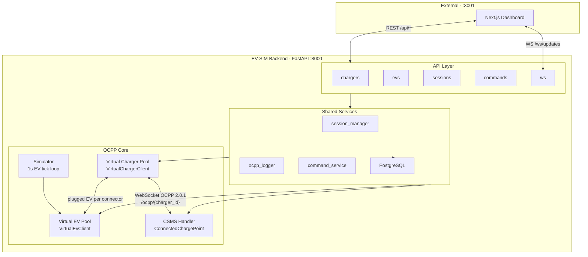

| Layer | Components | Responsibility |
|-------|------------|----------------|
| API | `chargers` · `evs` · `sessions` · `commands` · `ws` | REST endpoints and dashboard WebSocket broadcast |
| Shared Services | `session_manager` · `ocpp_logger` · `command_service` · PostgreSQL | Sessions, message log, outbound OCPP commands, persistence |
| OCPP Core | Virtual Charger Pool · Virtual EV Pool · CSMS Handler · Simulator | Simulated CP clients, EV battery model, OCPP 2.0.1 handling, SoC tick loop |

The backend is **monolithic but multi-role**: the same process hosts the CSMS WebSocket server, spawns virtual charger clients that connect back to it, and simulates EV batteries that plug into charger connectors. Chargers, EVs, and sessions survive restarts via PostgreSQL.

---

## Full Workflow

Use the buttons below to jump between workflow steps.

The complete demo flow is: **Startup → Create Charger → Connect → Create EV → Plug EV → Start Charging → Stop → OCPP Explorer → Fault Injection**. Steps 4–7 are the new Virtual EV feature — an EV must be plugged into a connector before a charging session can begin.

<p align="center">
  <a href="#wf-1"></a>
  <a href="#wf-2"></a>
  <a href="#wf-3"></a>
  <a href="#wf-4"></a>
  <a href="#wf-5"></a>
  <a href="#wf-6"></a>
  <a href="#wf-7"></a>
  <a href="#wf-8"></a>
  <a href="#wf-9"></a>
</p>

---

<h3 id="wf-1">1. Startup</h3>

Start PostgreSQL, then the FastAPI server:

```bash
docker compose up -d          # PostgreSQL on :5432
cp .env.example .env          # optional — defaults match docker-compose
uvicorn app.main:app --reload --host 0.0.0.0 --port 8000
```

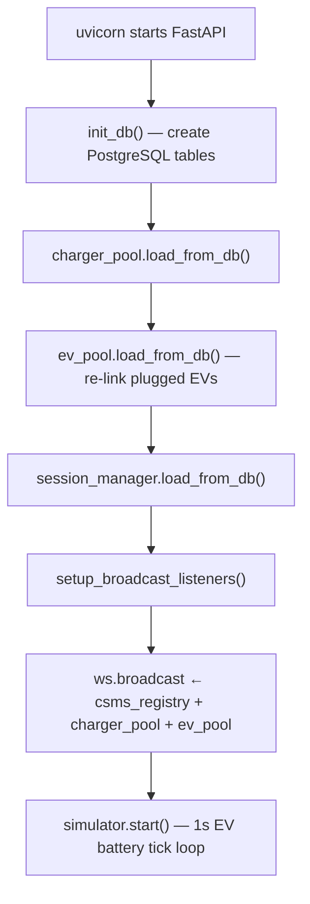

On restart, chargers, EVs, and sessions are restored from PostgreSQL. Plugged EVs are re-attached to their charger connectors automatically.

<p align="center">
  <a href="#wf-2"></a>
</p>

---

<h3 id="wf-2">2. Create a Virtual Charger</h3>

```http
POST /api/chargers
{ "id": "CP-001", "max_power_kw": 22, "connector_count": 2 }
```

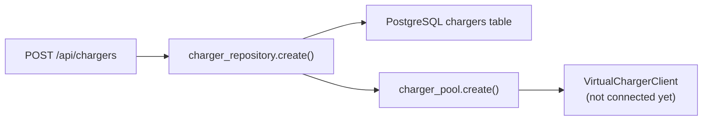

The charger record is persisted immediately. It survives server restarts but must be re-connected to CSMS after restart.

<p align="center">
  <a href="#wf-1"></a>
  <a href="#wf-3"></a>
</p>

---

<h3 id="wf-3">3. Connect Charger to CSMS</h3>

```http
POST /api/chargers/CP-001/connect
```

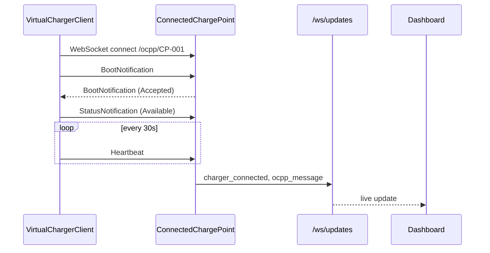

<p align="center">
  <a href="#wf-2"></a>
  <a href="#wf-4"></a>
</p>

---

<h3 id="wf-4">4. Create a Virtual EV</h3>

Create from a preset or with custom battery parameters:

```http
POST /api/evs
{
  "id": "EV-001",
  "vendor": "Tesla",
  "model": "Model 3 LR",
  "ev_type": "BEV",
  "battery_capacity_kwh": 82.0,
  "max_ac_charge_power_kw": 11.5,
  "max_dc_charge_power_kw": 250.0,
  "soc_percent": 25.0,
  "target_soc_percent": 80.0
}
```

Or browse presets first: `GET /api/evs/presets`

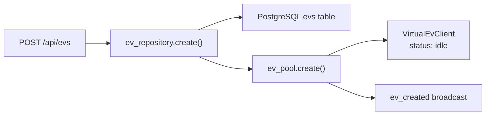

The EV starts in `idle` state with the configured SoC and target SoC. Use presets for realistic vehicle profiles (Tesla Model 3, BMW i4, Nissan Leaf, etc.).

<p align="center">
  <a href="#wf-3"></a>
  <a href="#wf-5"></a>
</p>

---

<h3 id="wf-5">5. Plug EV into Charger</h3>

```http
POST /api/evs/EV-001/plug
{ "charger_id": "CP-001", "connector_id": 1 }
```

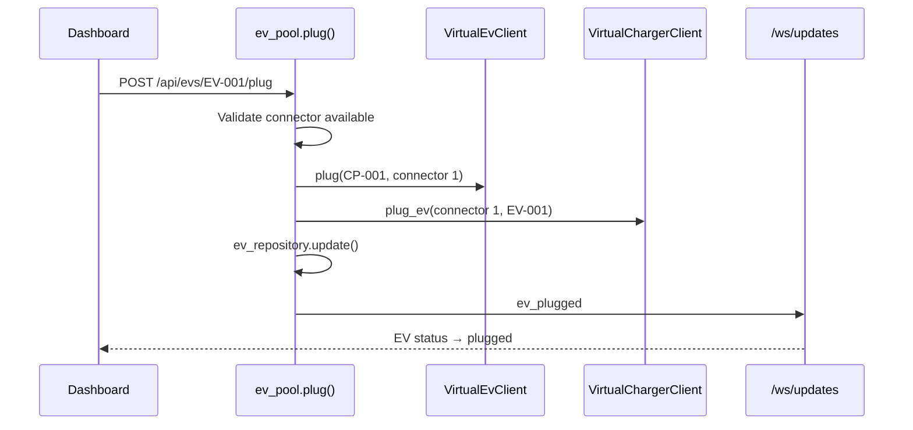

**Validation rules:**

- EV must be in `idle` state (not already plugged or charging)
- Connector must exist and be `Available` or `Preparing`
- Only one EV per connector

After plugging, the EV status becomes `plugged`. The charger tracks `_plugged_evs[connector_id] = ev_id`.

<p align="center">
  <a href="#wf-4"></a>
  <a href="#wf-6"></a>
</p>

---

<h3 id="wf-6">6. Start Charging</h3>

```http
POST /api/evs/EV-001/start-charging
```

Alternatively, use the charger-centric endpoint (same OCPP flow):

```http
POST /api/sessions/start
{ "charger_id": "CP-001", "connector_id": 1 }
```

> **Important:** A transaction only starts if an EV is plugged into the connector. Without a plugged EV, `RequestStartTransaction` is accepted but no `TransactionEvent (Started)` is sent.

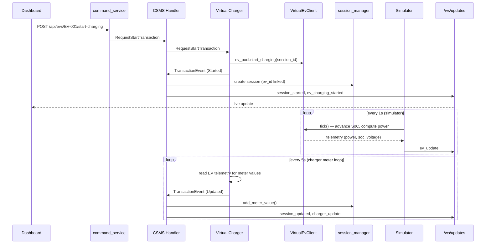

**Charging curve:** Power is `min(ev_max_kw, charger_max_kw)` with taper above 70% SoC (80% → 55% → 30% → 15% of max). When `soc_percent >= target_soc_percent`, the simulator auto-sends `RequestStopTransaction`.

<p align="center">
  <a href="#wf-5"></a>
  <a href="#wf-7"></a>
</p>

---

<h3 id="wf-7">7. Stop Charging</h3>

Manual stop:

```http
POST /api/evs/EV-001/stop-charging
```

Or charger-centric:

```http
POST /api/sessions/stop
{ "charger_id": "CP-001" }
```

Auto-stop when target SoC is reached (handled by `ev_pool.tick_all()` in the simulator loop).

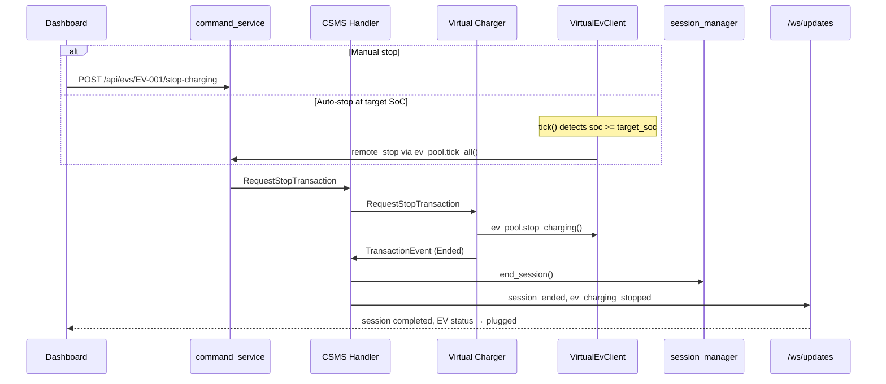

After stopping, the EV remains plugged (`plugged` status) and can be unplugged or charged again.

<p align="center">
  <a href="#wf-6"></a>
  <a href="#wf-8"></a>
</p>

---

<h3 id="wf-8">8. OCPP Explorer</h3>

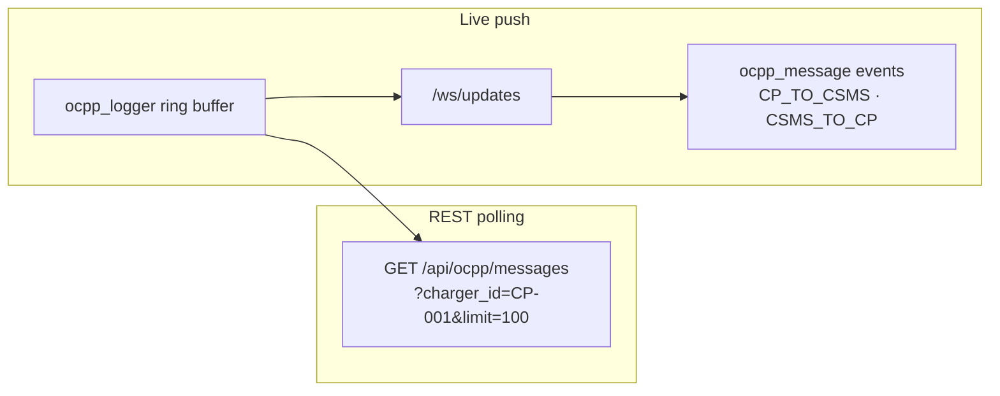

- **REST:** `GET /api/ocpp/messages?charger_id=CP-001&limit=100`
- **Live:** `ocpp_message` events on `/ws/updates` with direction `CP_TO_CSMS` or `CSMS_TO_CP`

<p align="center">
  <a href="#wf-7"></a>
  <a href="#wf-9"></a>
</p>

---

<h3 id="wf-9">9. Fault Injection</h3>

```http
POST /api/chargers/CP-001/fault?fault_type=connector_error
```

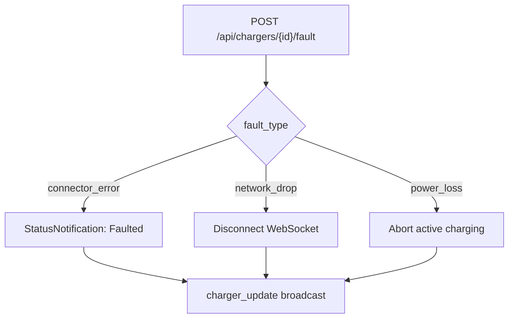

<p align="center">
  <a href="#wf-8"></a>
  <a href="#wf-1"></a>
</p>

---

## API Reference

### Chargers

| Method | Path | Body / Params | Response |
|--------|------|---------------|----------|
| GET | `/api/chargers` | — | `VirtualCharger[]` |
| POST | `/api/chargers` | `CreateChargerRequest` | `VirtualCharger` (201) |
| GET | `/api/chargers/{id}` | — | `VirtualCharger` |
| DELETE | `/api/chargers/{id}` | — | 204 |
| POST | `/api/chargers/{id}/connect` | — | `VirtualCharger` |
| POST | `/api/chargers/{id}/disconnect` | — | `VirtualCharger` |
| POST | `/api/chargers/{id}/fault` | `?fault_type=` | `{ success, fault_type }` |

### EVs

| Method | Path | Body / Params | Response |
|--------|------|---------------|----------|
| GET | `/api/evs` | — | `VirtualEv[]` |
| GET | `/api/evs/presets` | — | `EvPreset[]` |
| POST | `/api/evs` | `CreateEvRequest` | `VirtualEv` (201) |
| GET | `/api/evs/{id}` | — | `VirtualEv` |
| DELETE | `/api/evs/{id}` | — | 204 |
| POST | `/api/evs/{id}/plug` | `PlugEvRequest` | `VirtualEv` |
| POST | `/api/evs/{id}/unplug` | — | `VirtualEv` |
| POST | `/api/evs/{id}/start-charging` | — | `{ success, status }` |
| POST | `/api/evs/{id}/stop-charging` | — | `{ success, status }` |

### Sessions

| Method | Path | Body | Response |
|--------|------|------|----------|
| GET | `/api/sessions` | — | `Session[]` |
| GET | `/api/sessions/{id}` | — | `Session` |
| POST | `/api/sessions/start` | `StartSessionRequest` | `{ success, status }` |
| POST | `/api/sessions/stop` | `StopSessionRequest` | `{ success, status }` |

### Commands

| Method | Path | Body | Response |
|--------|------|------|----------|
| POST | `/api/commands/reset` | `ResetRequest` | `{ success, status }` |
| POST | `/api/commands/availability` | `AvailabilityRequest` | `{ success, status }` |
| POST | `/api/commands/unlock` | `UnlockRequest` | `{ success, status }` |

### Other

| Method | Path | Description |
|--------|------|-------------|
| GET | `/api/health` | `{ status, chargers, evs, connected }` |
| GET | `/api/ocpp/messages` | OCPP log (`charger_id`, `limit` query params) |
| WS | `/ocpp/{charger_id}` | OCPP 2.0.1 charge point protocol |
| WS | `/ws/updates` | Dashboard real-time events |

Interactive API docs: [http://localhost:8000/docs](http://localhost:8000/docs)

---

## WebSocket Events

Events broadcast on `/ws/updates` as `{ "type": "<event>", "data": { ... } }`:

| Event | When |
|-------|------|
| `ocpp_message` | Any OCPP request/response logged |
| `charger_connected` | BootNotification accepted |
| `charger_disconnected` | Virtual charger disconnected |
| `charger_update` | Status, heartbeat, or meter change |
| `session_started` | TransactionEvent Started |
| `session_updated` | Meter values during charging |
| `session_ended` | TransactionEvent Ended |
| `ev_created` | New virtual EV created |
| `ev_plugged` | EV plugged into a charger connector |
| `ev_unplugged` | EV unplugged from charger |
| `ev_charging_started` | EV entered charging state |
| `ev_charging_stopped` | EV stopped charging (manual or auto) |
| `ev_update` | Simulator tick — SoC, power, voltage updated (every 1s while charging) |
| `ev_deleted` | EV removed from fleet |

---

## OCPP Message Flow

<p align="center">
  <a href="#architecture-overview"></a>
  <a href="#full-workflow"></a>
</p>

```mermaid
flowchart LR
    subgraph CP["Charge Point → CSMS"]
        direction TB
        A1["BootNotification"]
        A2["Heartbeat"]
        A3["StatusNotification"]
        A4["Authorize"]
        A5["TransactionEvent"]
        A6["MeterValues"]
    end

    subgraph CSMS["CSMS → Charge Point"]
        direction TB
        B1["RequestStartTransaction"]
        B2["RequestStopTransaction"]
        B3["Reset"]
        B4["ChangeAvailability"]
        B5["UnlockConnector"]
    end

    CP <-->|"OCPP-J · WebSocket<br/>subprotocol ocpp2.0.1"| CSMS
```

| Direction | Actions |
|-----------|---------|
| CP → CSMS | BootNotification, Heartbeat, StatusNotification, Authorize, TransactionEvent, MeterValues |
| CSMS → CP | RequestStartTransaction, RequestStopTransaction, Reset, ChangeAvailability, UnlockConnector |

Message format follows OCPP-J (JSON over WebSocket) with subprotocol `ocpp2.0.1`.

---

## Getting Started

### Prerequisites

- Python 3.11+ (3.14 tested)
- pip
- Docker (for PostgreSQL) or an existing PostgreSQL 16 instance

### Install & Run

```bash
cd backend

# 1. Start PostgreSQL
docker compose up -d

# 2. Configure database URL (optional — matches docker-compose defaults)
cp .env.example .env

# 3. Python environment
python3 -m venv venv
source venv/bin/activate        # Windows: venv\Scripts\activate
pip install -r requirements.txt

# 4. Start API server
uvicorn app.main:app --reload --host 0.0.0.0 --port 8000
```

Server runs at [http://localhost:8000](http://localhost:8000). PostgreSQL runs at `localhost:5432` (database: `ev-sim-db`).

### Quick Test

```bash
# Create charger
curl -X POST http://localhost:8000/api/chargers \
  -H "Content-Type: application/json" \
  -d '{"id": "CP-001", "max_power_kw": 22, "connector_count": 2}'

# Connect to CSMS
curl -X POST http://localhost:8000/api/chargers/CP-001/connect

# Create EV
curl -X POST http://localhost:8000/api/evs \
  -H "Content-Type: application/json" \
  -d '{"id": "EV-001", "vendor": "Tesla", "model": "Model 3 LR", "battery_capacity_kwh": 82, "max_ac_charge_power_kw": 11.5, "max_dc_charge_power_kw": 250, "soc_percent": 25, "target_soc_percent": 80}'

# Plug EV into charger
curl -X POST http://localhost:8000/api/evs/EV-001/plug \
  -H "Content-Type: application/json" \
  -d '{"charger_id": "CP-001", "connector_id": 1}'

# Start charging
curl -X POST http://localhost:8000/api/evs/EV-001/start-charging

# Health check
curl http://localhost:8000/api/health
```

---

## Frontend Integration

The EV-SIM Next.js frontend (default port **3001**) connects to this backend:

| Frontend need | Backend endpoint |
|---------------|------------------|
| Charger list & detail | `GET/POST /api/chargers` |
| EV fleet & detail | `GET/POST /api/evs`, `GET /api/evs/presets` |
| Plug / unplug EV | `POST /api/evs/{id}/plug`, `/unplug` |
| EV charging control | `POST /api/evs/{id}/start-charging`, `/stop-charging` |
| Connect / disconnect charger | `POST /api/chargers/{id}/connect` |
| Session control (charger-centric) | `POST /api/sessions/start`, `/stop` |
| Live updates | `WS /ws/updates` (includes `ev_*` events) |
| OCPP message log | `GET /api/ocpp/messages` |

Ensure CORS allows the frontend origin (currently `*` for development).

---

## Reference Codebases

Design patterns are inspired by:

- **[ocpp-virtual-charge-point](https://github.com/solidstudiosh/ocpp-virtual-charge-point)** — Virtual charger OCPP message patterns
- **[citrineos-core](https://github.com/citrineos/citrineos-core)** — CSMS handler reference (BootNotification, TransactionEvent)

---

## License

Part of the EV-SIM project. See the main repository for license details.
